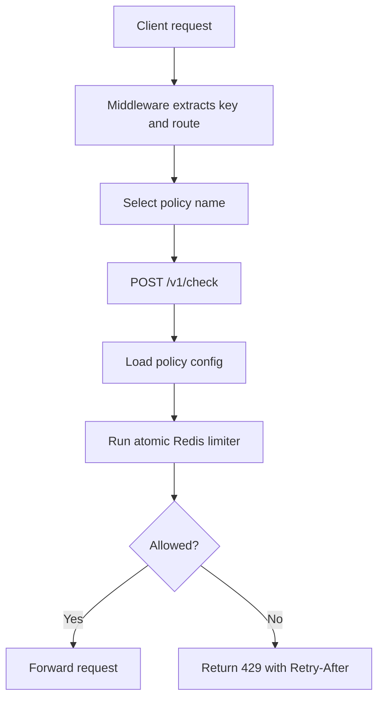
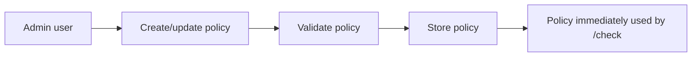
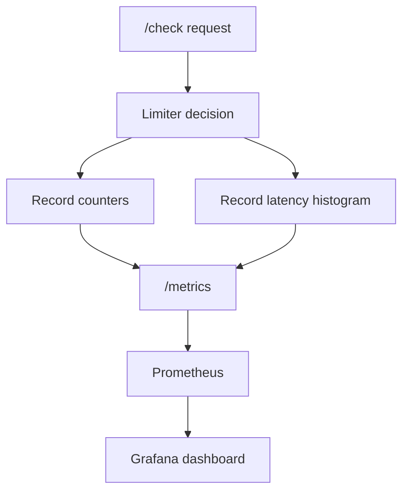
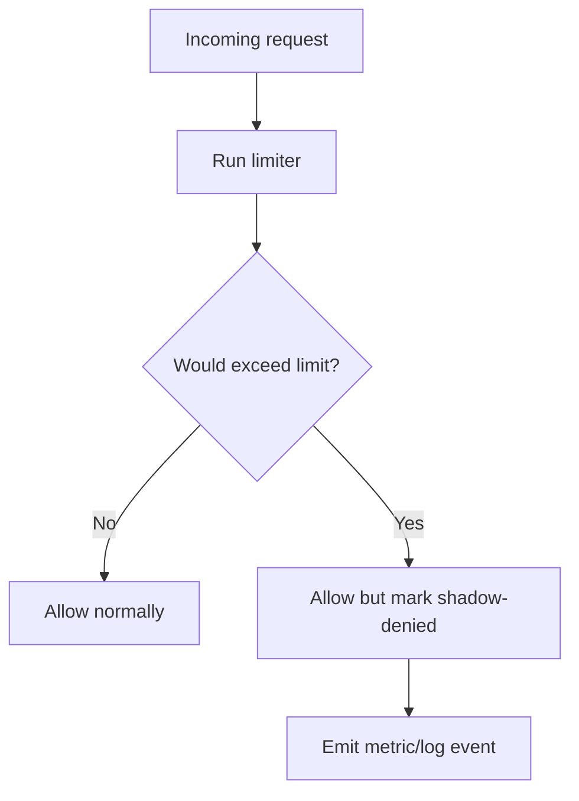
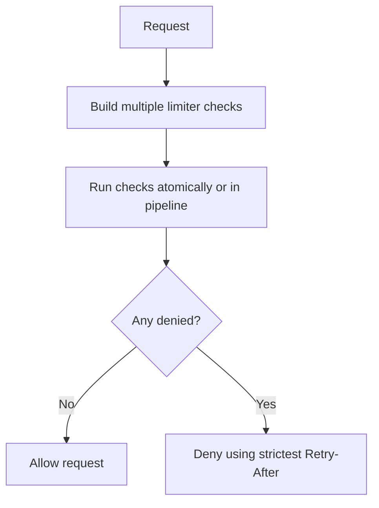
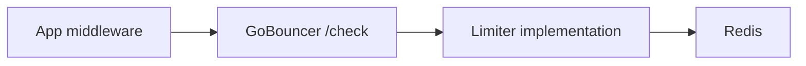
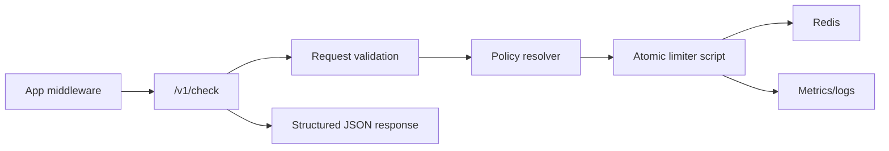

# GoBouncer Project Audit and Upgrade Report

Date: 2026-06-11

## Executive Summary

GoBouncer is a promising Redis-backed rate limiting project written in Go. The core idea is strong: expose rate limiting as both an HTTP service and a reusable Go middleware/client package. The codebase is small, readable, and already has unit tests for the two limiter strategies.

The project is currently best described as an early-stage prototype with a solid foundation, not yet production-ready. The biggest upgrade areas are API contract correctness, atomic Redis execution, input validation, environment configuration, and observability.

Overall project rating: **5.8 / 10**

My point of view: this project has a good product shape. A developer-friendly rate limiter can become genuinely useful if it focuses on correctness, easy adoption, and operational visibility. The next milestone should be "make the current promise reliable" before adding too many new features.

## Current Feature Inventory

| Area | Current feature | Status | Notes |
|---|---:|---:|---|
| HTTP API | `POST /check` | Implemented | Checks whether a key is allowed under a limit/window. |
| HTTP API | `GET /health` | Implemented | Basic liveness endpoint returns `OK`. |
| Limiter core | Sliding window algorithm | Implemented | Uses Redis sorted sets. Good conceptual fit, but not atomic under concurrency. |
| Limiter core | GCRA algorithm | Implemented | Memory efficient alternative using one Redis string per key. Also not atomic yet. |
| Storage | Redis backend | Implemented | Uses `github.com/redis/go-redis/v9`. |
| Middleware | Go HTTP middleware | Implemented | Includes key extraction by IP/header and standard rate limit headers. |
| Client SDK | Go client for GoBouncer service | Implemented | Includes timeout, connection reuse, and fail-open option. |
| Testing | Unit tests with miniredis | Implemented | Good coverage for basic limiter behavior. |
| Testing | Integration tests | Implemented behind build tag | Real Redis tests are present but optional. |
| Operations | Graceful shutdown | Implemented | HTTP server handles SIGINT/SIGTERM. |
| Build tooling | Makefile | Implemented | Includes build, test, vet, coverage, and clean targets. |
| Configuration | Environment-driven config | Partially missing | README claims `.env`, but `config.Load()` is hardcoded. |
| Observability | Logging | Basic | Uses `slog`, but no request logs, metrics, tracing, or dashboards. |

## Verification Performed

Commands run:

```bash
go test ./...
go vet ./...
go build ./cmd/api/...
```

Result: all three passed successfully.

Important note: passing tests do not prove production correctness yet because the tests do not cover API/middleware compatibility, invalid inputs, Redis error paths, or high-concurrency behavior.

## Ratings

| Category | Rating | Reason |
|---|---:|---|
| Product idea | 8/10 | A standalone + middleware rate limiter is useful and easy to understand. |
| Code readability | 7/10 | Small files, clear names, and understandable flow. Some comments contain encoding artifacts. |
| Core abstraction | 7/10 | `Algorithm` interface is clean and lets strategies swap easily. |
| Sliding window implementation | 5/10 | Functionally works in sequential tests, but Redis operations are not atomic. |
| GCRA implementation | 5/10 | Good memory profile, but `GET` + `SET` race makes it unsafe under concurrent load. |
| HTTP API | 5/10 | Simple, but lacks validation, error consistency, versioning, and request contract tests. |
| Go middleware/client | 4/10 | Useful concept, but currently has a JSON field mismatch with the API. |
| Configuration | 3/10 | Hardcoded config conflicts with README and deployment expectations. |
| Tests | 5/10 | Good starting unit tests, but missing handler, middleware, validation, and concurrency tests. |
| Documentation | 4/10 | README explains intent, but it is outdated/inaccurate in important places. |
| Production readiness | 4/10 | Needs atomic Redis scripts, config, observability, validation, and deployment assets. |

## What Is Implemented Nicely

1. **Clean algorithm interface**
   - `internal/limiter/limiter.go` defines a small `Algorithm` interface.
   - This makes it easy to add or switch rate limiting strategies.

2. **Two limiter strategies already exist**
   - Sliding window is intuitive and accurate.
   - GCRA is memory efficient and better suited for high-volume workloads.

3. **Middleware direction is strong**
   - `pkg/middleware` suggests a good developer experience: configure once and wrap handlers.
   - Built-in key functions for IP/header are practical.

4. **Graceful shutdown and server timeouts**
   - The HTTP server has read, write, idle timeouts and shutdown handling.
   - This is a good production habit already present.

5. **Miniredis tests**
   - Using an in-memory Redis-compatible server is a smart testing choice.

## Main Problems and Risks

### 1. Middleware and API request contract mismatch

The middleware client sends:

```json
{
  "key": "...",
  "limit": 100,
  "window_ms": 60000
}
```

The API handler expects:

```json
{
  "key": "...",
  "limit": 100,
  "window": 60000
}
```

Impact: middleware requests can arrive with `window` as zero. That can cause wrong expiry behavior and GCRA division-by-zero risk.

Priority: **Critical**

Recommendation:

- Standardize the field as `window_ms`.
- Update both handler and client.
- Add handler + client compatibility tests.

### 2. Redis limiter operations are not atomic

Sliding window does:

1. Remove expired entries.
2. Count entries.
3. If under limit, add a new entry.

Those steps are split across multiple Redis operations. Under concurrent requests, multiple callers can all see count below limit and all add themselves, allowing more traffic than configured.

GCRA has the same issue because it reads TAT with `GET`, calculates, then writes with `SET`.

Impact: limits can be bypassed during traffic spikes, exactly when the limiter matters most.

Priority: **Critical**

Recommendation:

- Implement both algorithms as Redis Lua scripts.
- Execute check/update in one atomic Redis `EVALSHA` call.
- Add high-concurrency tests that assert allowed requests never exceed limit.

### 3. Missing request validation

`key`, `limit`, and `window`/`window_ms` are accepted without validation.

Bad cases:

- Empty key
- `limit <= 0`
- `window <= 0`
- Very large windows/limits
- Invalid JSON with unknown fields

Impact:

- Division by zero in GCRA.
- Broken expiries.
- Poor client error messages.
- Potential resource abuse.

Priority: **High**

Recommendation:

- Validate at the HTTP boundary.
- Return structured JSON errors.
- Reject invalid input with `400 Bad Request`.

### 4. Configuration is hardcoded

README says the project is environment driven, but `config.Load()` returns hardcoded values:

- Redis: `localhost:6379`
- Port: `:8080`
- Algorithm: `sliding_window`

Impact: difficult deployment, misleading docs, no clean way to use remote Redis or switch algorithm.

Priority: **High**

Recommendation:

- Read from environment variables.
- Support `.env` for local development if desired.
- Add Redis password, DB, TLS, algorithm, port, log level, fail mode.

### 5. Error behavior is inconsistent

Sliding window fails closed on Redis error:

- `Allowed: false`

GCRA fails open on Redis error:

- `Allowed: true`

Client middleware has a configurable fail-open option.

Impact: system behavior changes depending on selected algorithm. That is dangerous in production.

Priority: **High**

Recommendation:

- Move fail-open/fail-closed policy into configuration.
- Make limiter implementations return `(Result, error)` instead of hiding storage errors.
- Let the API layer decide whether to allow or deny.

### 6. Documentation is outdated

README says:

- Go 1.26 or higher.
- `.env` configuration exists.
- `godotenv` dependency exists.
- Sliding window is the only algorithm.

But the code:

- Uses `go 1.26.3` in `go.mod`.
- Does not load `.env`.
- Does not include `godotenv`.
- Also includes GCRA.

Priority: **Medium**

Recommendation:

- Update README after config and API contract are fixed.
- Add usage examples for service mode and middleware mode.

## Upgrade Roadmap

### Phase 1: Stabilize Current Product

Goal: make the existing API and middleware reliable.

Recommended work:

- Fix API/client JSON field mismatch.
- Add validation and structured error responses.
- Make limiter methods return errors.
- Standardize fail-open/fail-closed behavior.
- Add handler tests and middleware integration tests.
- Update README to match actual behavior.

Estimated impact: high  
Estimated difficulty: low to medium

### Phase 2: Make Rate Limiting Correct Under Load

Goal: guarantee limit correctness in distributed/concurrent traffic.

Recommended work:

- Convert sliding window check/update to Redis Lua.
- Convert GCRA check/update to Redis Lua.
- Add concurrency tests with many goroutines.
- Add benchmark tests for both algorithms.
- Decide default algorithm based on product goal:
  - Sliding window for strict rolling-window accuracy.
  - GCRA for high-throughput, memory-efficient smoothing.

Estimated impact: very high  
Estimated difficulty: medium

### Phase 3: Production Operations

Goal: make GoBouncer deployable and observable.

Recommended work:

- Environment config with `.env` support for local development.
- Dockerfile and `docker-compose.yml` with Redis.
- `/ready` endpoint that checks Redis connectivity.
- Prometheus metrics:
  - total checks
  - allowed checks
  - denied checks
  - Redis errors
  - check latency
  - active limiter keys
- Structured request logging with request ID.

Estimated impact: high  
Estimated difficulty: medium

### Phase 4: Developer Experience

Goal: make it easy for other Go developers to adopt.

Recommended work:

- Public package docs and examples.
- Middleware tests.
- Support per-route limits.
- Support custom deny responses.
- Support dynamic key prefixes.
- Add versioned API path like `/v1/check`.
- Add OpenAPI spec.

Estimated impact: medium to high  
Estimated difficulty: medium

### Phase 5: Advanced Product Features

Goal: make GoBouncer more than a simple limiter.

Recommended work:

- Named policies stored in Redis/Postgres/YAML.
- Admin API to create/update/delete policies.
- Multi-dimensional limits:
  - by IP
  - by user ID
  - by API key
  - by route
  - by tenant
- Quotas and daily/monthly usage limits.
- Shadow mode for observing without blocking.
- Dashboard for traffic and top limited keys.

Estimated impact: high if this becomes a product  
Estimated difficulty: medium to high

## Suggested New Features

### Feature 1: Named Rate Limit Policies

Instead of every client passing `limit` and `window_ms`, define named policies:

```json
{
  "policy": "free-api",
  "key": "user:123"
}
```

Example policies:

| Policy | Limit | Window | Use case |
|---|---:|---:|---|
| `public-ip` | 60 | 1 minute | Anonymous traffic |
| `free-api` | 1000 | 1 day | Free users |
| `pro-api` | 50000 | 1 day | Paid users |
| `login` | 5 | 5 minutes | Login brute-force protection |

Flow:



Why this helps:

- Clients do not need to know numeric limits.
- Limits can change centrally.
- Safer for multi-service systems.

### Feature 2: Admin API for Policies

Endpoints:

- `POST /v1/policies`
- `GET /v1/policies`
- `GET /v1/policies/{name}`
- `PUT /v1/policies/{name}`
- `DELETE /v1/policies/{name}`

Flow:



Why this helps:

- GoBouncer becomes configurable without redeploying apps.
- Teams can manage different rate plans.

### Feature 3: Observability and Metrics

Add Prometheus endpoint:

- `GET /metrics`

Metrics:

- `gobouncer_checks_total`
- `gobouncer_allowed_total`
- `gobouncer_denied_total`
- `gobouncer_redis_errors_total`
- `gobouncer_check_duration_seconds`

Flow:



Why this helps:

- You can prove the limiter is working.
- You can debug spikes and denied traffic.
- Production users expect this.

### Feature 4: Shadow Mode

Shadow mode means GoBouncer calculates whether a request should be denied, but does not actually block it.

Response headers can include:

- `X-RateLimit-Shadow-Allowed: false`
- `X-RateLimit-Retry-After: 1200`

Flow:



Why this helps:

- Teams can test limits before enforcing.
- Reduces risk when onboarding a new service.

### Feature 5: Multi-Key Rate Limiting

A single request may need multiple checks:

- IP limit
- User limit
- API key limit
- Route limit

Example:

```json
{
  "checks": [
    {"policy": "ip-public", "key": "ip:1.2.3.4"},
    {"policy": "user-free", "key": "user:123"},
    {"policy": "route-login", "key": "route:/login:user:123"}
  ]
}
```

Flow:



Why this helps:

- Real systems need layered protection.
- Login endpoints and expensive APIs can have tighter limits.

## Recommended Architecture Upgrade

Current shape:



Recommended near-term shape:



Recommended internal package layout:

```text
cmd/api/
  main.go
internal/
  api/
    handlers.go
    errors.go
    routes.go
  config/
    config.go
  limiter/
    algorithm.go
    gcra.go
    sliding_window.go
    scripts/
  policy/
    policy.go
    store.go
  observability/
    metrics.go
pkg/
  middleware/
  client/
```

## Testing Upgrade Plan

Add tests in this order:

1. Handler tests for `/check`.
2. Middleware-to-service compatibility test.
3. Invalid request tests:
   - missing key
   - zero limit
   - negative limit
   - zero window
   - malformed JSON
4. Concurrency tests:
   - 100 goroutines with limit 10 must allow exactly 10.
5. Redis error behavior tests:
   - fail-open
   - fail-closed
6. Benchmarks:
   - sliding window sequential
   - sliding window concurrent
   - GCRA sequential
   - GCRA concurrent

## API Improvement Proposal

Current API:

```http
POST /check
```

Recommended API:

```http
POST /v1/check
Content-Type: application/json
```

Request:

```json
{
  "key": "user:123",
  "limit": 100,
  "window_ms": 60000,
  "algorithm": "gcra"
}
```

Response when allowed:

```json
{
  "allowed": true,
  "remaining": 99,
  "retry_after_ms": 0,
  "reset_after_ms": 60000,
  "algorithm": "gcra"
}
```

Response when denied:

```json
{
  "allowed": false,
  "remaining": 0,
  "retry_after_ms": 1200,
  "reset_after_ms": 1200,
  "algorithm": "gcra"
}
```

Response when invalid:

```json
{
  "error": {
    "code": "invalid_request",
    "message": "window_ms must be greater than zero"
  }
}
```

## Security and Reliability Recommendations

- Add max body size for `/check`.
- Reject unknown JSON fields.
- Add optional API key authentication for GoBouncer service calls.
- Add Redis key prefixing to avoid collisions.
- Sanitize or hash extremely long keys.
- Add request timeout around Redis calls.
- Close Redis client on shutdown.
- Add readiness endpoint that verifies Redis.
- Add rate limiter service self-protection.

## Priority Backlog

### P0

- Fix `window_ms` vs `window` mismatch.
- Validate `key`, `limit`, and `window_ms`.
- Prevent GCRA division by zero.
- Add API/middleware compatibility tests.

### P1

- Make Redis limiter operations atomic with Lua.
- Standardize fail-open/fail-closed behavior.
- Add environment configuration.
- Update README.

### P2

- Add Dockerfile and Compose.
- Add Prometheus metrics.
- Add `/ready`.
- Add structured JSON error responses.

### P3

- Add named policies.
- Add admin API.
- Add OpenAPI spec.
- Add dashboard examples.

## Final Opinion

GoBouncer has a good foundation and a marketable direction: "simple distributed rate limiting for Go services." The project should not jump straight into a dashboard or complex admin features yet. First, make the core promise rock solid:

1. The middleware must talk to the service correctly.
2. The limiter must be correct under concurrent traffic.
3. The service must be configurable and observable.

After that, named policies and shadow mode would make the project feel professional and genuinely useful for real applications.
